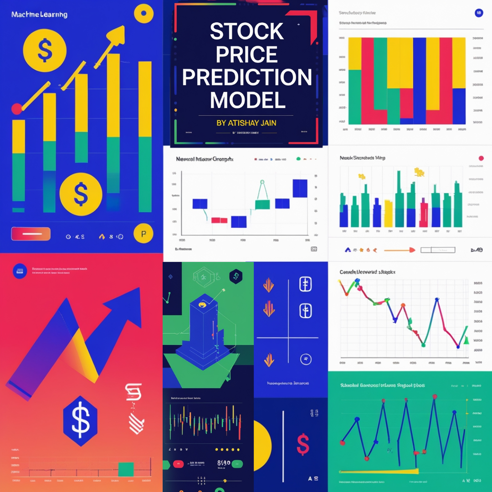

#Stock Price Prediction Model

◦ Developed a time series regression model to predict daily stock closing prices using an LSTM-based deep learning architecture on real stock market data.
 
◦ Collected and processed historical stock data from Yahoo Finance API; applied scaling, sequence windowing, and data preparation for supervised learning.
 
◦ Designed and trained a multi-layer LSTM model with dropout and tuned hyperparameters to effectively capture temporal patterns in price movements.
 
◦ Evaluated model performance using MAE, RMSE, and R² metrics; achieved high accuracy with an R² of 0.9681 and strong generalization across multiple stocks.
 
◦ Visualized predictions vs actual prices and implemented detailed error analysis to interpret model behavior and identify outlier deviations.
 
◦ Packaged the entire pipeline into a modular Python framework, integrated plots, and published the project with a comprehensive README and live demo in Colab.
 
